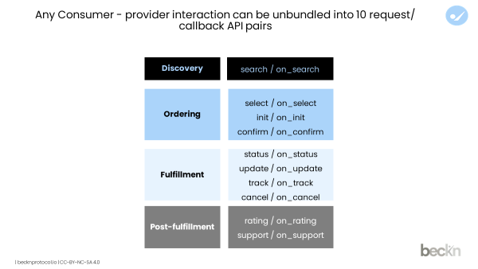

# Chapter 5: DSEP APIs



1. DSEP has 10 pairs of APIs - the pairs being categorised as by request and callback in the DSEP order lifecycle from Discovery to Post-Fulfillment.&#x20;
2. These APIs are asynchronous, that is, a request and a response are not in the same session. The response is delivered via a callback corresponding to the request API.
3. The interactions are all server-to-server. The DSEP specification is agnostic of the implementation of these APIs.
4. The DSEP do not impose any recommendations on the implementation of the services behind the API.
5. The DSEP APIs are stateless APIs by default, but can transmit state information if needed.
6. **Stage-wise API break-up:**\
   **Discovery** - Search & On\_Search\
   **Ordering** - Select & On\_Select ; Init & On\_Init ; Confirm & On\_Confirm\
   **Fulfillment** - Status & On\_Status ; Update & On\_Update ; Track & On\_Track ; Cancel & On\_Cancel\
   **Post-Fulfillment** - Rating & On\_Rating ; Support & On\_Support .
7. **In the Discovery stage,** \
   A BAP fires a **Search API** request that passes through the DSEP gateway. The gateway broadcasts the search to the BPPs, and the relevant BPPs respond through individual **On\_Search API** with their respective catalogues and service character corresponding to the search request from BAP.  This search request from BAP contains the `Intent` - which is to "buy", "avail" or "enroll".
8. **In the Ordering Stage,** \
   the BAP fires a **Select API** where the user selects the service provider basis the items in BPP's catalogue, service character & offers. The BPP then responds through an **On\_Select API** with the service details along with any add-on promotional offers and then sends dynamic quote to the BAP.\
   Once having received the quote from BPP, the BAP fires an **Init API** call indicating that the consumer has agreed to the quote from BPP. The consumer shares their details and requests to understand the terms of engagement. In response through **On\_Init API**, the BPP may re-calculate the quote basis the consumer details and send the final quote. \
   To agree to the quote the consumer through the BAP fires a **Confirm API** call to the BPP. The BPP creates an order and responds to BAP with the order details through the **On\_Confirm API**.
9. **In the Fulfillment Stage,** once the order is confirmed\
   The **Status** and **On\_Status API** is used to fetch the latest state of the order to inform the Consumer (BAP) of the status of the order. \
   The **Update API** is fired by consumer (BAP) to revise the terms of the order and the other party will respond through **On\_Update AP**I with the new terms of the order. This stage **may route back to ordering stage** where the participant has to confirm the order with new terms.\
   The BAP can use **Track API** to track orders where relevant. The BPP will respond with **On\_Track API** to the BAP with a link to track the order. \
   An order can be cancelled by both parties. A **Cancel API** can be called by consumer (BAP) and BPP responds to the request through the **On\_Cancel API**. When a BPP cancels an order they send the request through **On\_Cancel API**.
10. **In the Post-Fulfillment stage**,\
    The **Rating API** is used by the BAP to rate a product/service and the BPP can provide a feedback URL to the BAP through an **On\_Rating API.**\
    The **Support API** request is sent by the Consumer (BAP) and the Provider (BPP) responds through the **On\_Support API** with a phone number, email or chat URL to the BAP.\
    &#x20;

<figure><figcaption></figcaption></figure>

<figure><figcaption></figcaption></figure>

<figure><figcaption></figcaption></figure>

<figure><figcaption></figcaption></figure>

<figure><figcaption></figcaption></figure>

<figure><figcaption></figcaption></figure>

<figure><figcaption></figcaption></figure>

<figure><figcaption></figcaption></figure>

<figure><figcaption></figcaption></figure>

<figure><figcaption></figcaption></figure>

<figure><figcaption></figcaption></figure>

<figure><figcaption></figcaption></figure>
