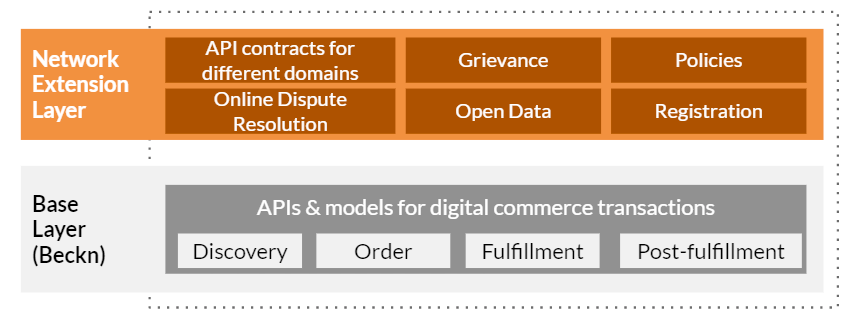
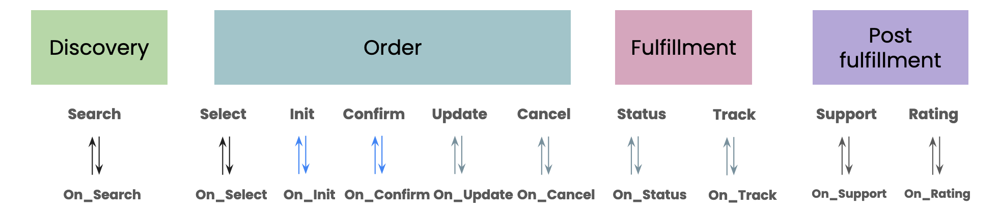

# Understanding the APIs

### Introduction

ONEST Protocol layered architecture is illustrated as shown in the diagram below. The base layer refers to the Beckn Protocol, which is an open source decentralized protocol. Over the base layer, the network extension layer comprises the API contracts customized to the ONEST context, along with other specs that have been adopted in order to facilitate transactions in the network.

<figure><figcaption></figcaption></figure>

Here is an overview to help you visualize the mapping between transactional flow and the APIs as part of ONEST protocol.

<figure><figcaption></figcaption></figure>

Refer to [Beckn Protocol Specification](https://developers.becknprotocol.io/docs/introduction/beckn-protocol-specification/) for more details about the APIs.&#x20;

### Example

Below is the example usage of protocol APIs in ONEST Learning Experiences Domain.

| API            | Usage                                                    |
| -------------- | -------------------------------------------------------- |
| Search API     | Discover the courses                                     |
| On Search API  | Returns the course catalogue                             |
| Select API     | Select the course and get quote                          |
| On Select API  | Returns the complete course details along with quote     |
| Init API       | Initialize the course subscription                       |
| On Init API    | Send order details with payment terms                    |
| Confirm API    | Confirm the course subscription                          |
| On Confirm API | Send course content details (like video player, PDF etc) |
| Status API     | Request the course consumption status                    |
| On Status API  | Returns the course consumption status                    |
| Rating API     | Provide rating for the course, cousre provider etc       |
| On Rating API  | Acknowledge rating                                       |

\
Refer to [reference-implementation-guides](reference-implementation-guides/ "mention")to understand APIs usage in other ONEST domains (Financial Support, Work Opportunities and Expert Connect).

Refer to [API Spec](https://raw.githubusercontent.com/beckn/protocol-specifications/8479762c101c385125cd66ecb907817ed6bdd231/api/transaction/build/transaction.yaml) to understand the schemas.
